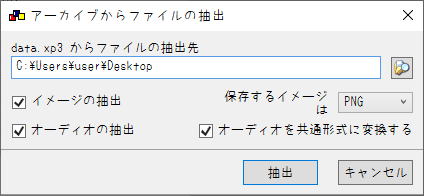
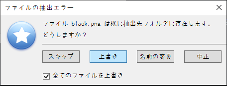

# KIRIKIRI2ONS_yorunohitsuji_kodoyuri

## なにこれ
  2011年に夜のひつじ様から発売された、PC向けノベルゲーム'[孤独に効く百合](http://yorunohitsuji.xii.jp/products/kodoyuri)'を<br>
  ONScripter形式へ変換するためのコンバータです<br>

## 再現度
原作との主な違いは以下
 - いくつかの処理のwait時間が実際と違う
 - CGモードはクリア後に全開放&超簡易実装
 - 改ページの位置が原作と全然合ってない
 - 画面左下のボタンは全て未実装
 - セーブ/ロード画面は簡略化

それ以外の部分に関してはぼちぼち再現できてるかと<br>


## 使い方
 1. 適当な作業フォルダを作成
 2. [GARBro](https://drive.google.com/file/d/1gH9nNRxaz8GexN0B1hWyUc3o692bkWXX/view)でdata.xp3を作業フォルダへ展開<br>

     設定は以下の通り↓<br>
     <br>
     抽出エラー時は上書きしてください↓<br>
     <br>

 3. 展開先のディレクトリで[このコンバータ](https://github.com/Prince-of-sea/KIRIKIRI2ONS_yorunohitsuji_kodoyuri/releases/latest)をDL/起動させ変換(一瞬で終わります)<br>
    変換前の時点で以下のような構成になっていればOKです↓<br>
```
C:.
│  KIRIKIRI2ONS_yorunohitsuji_kodoyuri.exe
│  
└─data
    │  startup.tjs
    │  
    ├─bgimage
    │      01_0_0.png
    │      (～略)
    │      差分リスト.txt
    │      
    ├─bgm
    │      kanasii_02.ogg
    │      (～略)
    │      yoruhaakeru.ogg
    │      
    ├─fgimage
    │      ceri.png
    │      (～略)
    │      seri_51.png
    │      
    ├─image
    │      about.png
    │      (～略)
    │      sysbt_bt_title_3mode.png
    │      
    ├─others
    │      AfterInit.tjs
    │      (～略)
    │      SliderFuntion.tjs
    │      
    ├─rule
    │      blind0.png
    │      (～略)
    │      虫食い.png
    │      
    ├─scenario
    │      A000.ks
    │      (～略)
    │      title.ks
    │      
    ├─sound
    │      door04.wav
    │      (～略)
    │      water04.wav
    │      
    ├─system
    │      AnimationLayer.tjs
    │      (～略)
    │      YesNoDialog.tjs
    │      
    └─video
            ～このファイルは削除してかまいません～.txt
            
```
 4. ウィンドウが消え、0.txtができれば完成<br>
    exe等の不要データを削除し、変換済みファイルと共に利用ハードへ転送

## 注意事項
 - 当然ですが公式ツールではありません
 - __FANZA DL版で動作確認しています__ その他の動作は未確認
 - 本ツールの使用において生じた問題や不利益などについて、作者は一切の責任を負いません
 - Androidでのプレイを想定している場合は、<br>
 本ツールではなく[Kirikiroid2](https://github.com/zeas2/Kirikiroid2/releases)の利用を強くおすすめします
 - 制作サークル様に迷惑をかけたくないので、<br>
   本ツールのSNS等での拡散は**ご遠慮ください**<br>
   (拡散されるほどのツールでもない気はするが一応)<br>

## その他
本作の変換を追加でサポートする[PSP向け自動変換ツール作ってます](https://github.com/Prince-of-sea/ONScripter_Multi_Converter)<br>
もしPSPで遊ぶ場合はぜひご利用ください(v1.4.8以上推奨)